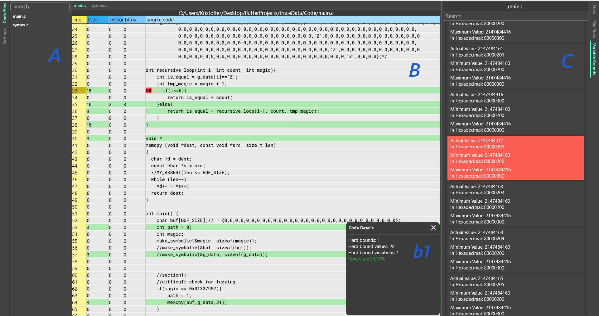

# Visualizing Symbolic Execution Traces

This is a simple visualization built in [Flutter](https://flutter.dev/), that visualizes symbolic execution traces on a code view level.
It shows the line, branch coverage and count, as well as where HardBounds where used.

## Usage 

Flutter needs to be installed.

When using the exampleData trace file you need to change the "fileName", to be the absolute path of the code file in exampleData/code.

In `demo` folder run
1. `flutter pub upgrade`
2. `flutter run -d linux` (or windows)
3. on start select trace.json from example data for the example shown in the picture

## Aknowledgements

- a major UI package used: [pluto_layout 1.0.0](https://pub.dev/packages/pluto_layout)

